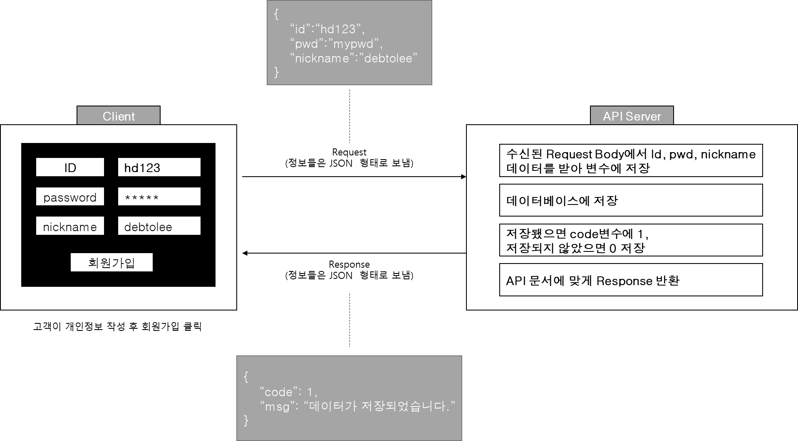

# API

API란 Application Programming Interface의 약자로 애플리케이션 사이의 규약을 통해 소통하는 인터페이스이다.
카페에 갔을 때 상황을 생각해보자.
고객은 카페에 들어가서 메뉴를 고르고 키오스크의 특정 단계에 맞에 주문을 하게된다.

<ul>
- 주문내역
<ol>
<li>아메리카노 ICE 1개</li>
<li>아인슈페너 ICE 1개</li>
<li>아이스케이크 1개</li>
</ol>
- 포장여부 : 포장
</ul>

결제를 하게되면 직원이 주문서를 확인하여 내용에 맞는 음료나 디저트를 제조하게된다.

제조된 음료와 디저트는 고객에게 전달되는데, 이떄 고객이 주문할 때 요청한 내용에 따라 케리어에 담거나 홀에서 먹을 수 있도록 쟁반에 담아 전달해주게 된다.

API 과정에서 비교하게되면 다음과 같다.

| 회원가입 API   |     회원가입 API 내용       |      카페      |
| :----------- | ----------- | -----------: |
| Client Request 송신 |  Client가 API Server로 회원가입 데이터를 담아 Request를 보냄 |  고객 주문 |
| API Request 수신 |  Client로부터 수신된 API Server는 Client가 보낸 회원데이터를 변수에 담는다. |  고객 주문 |
| API Logic 수행 |  데이터베이스에 회원데이터를 저장한다. |  고객 주문 제조 |
| API Response 송신 |  데이터베이스에 저장 성공 여부를 Client에 Response Body에 담아 송신 |  고객 주문 |
| Client Response 수신 |  서버로부터 수신된 Response 데이터를 확인해 성공했으면 로그인 페이지로 이동, 실패했으면 다시 요청할 것을 표시|  고객 확인 후 매장 퇴장 |

